# Лабораторная по Toolkit, Postman
## [Задание 1](toolkit/1/) (Добавил node_modules в gitignore)
## Задание 2
- [Исходный код](toolkit/2/)
- Запрос из браузера не получился
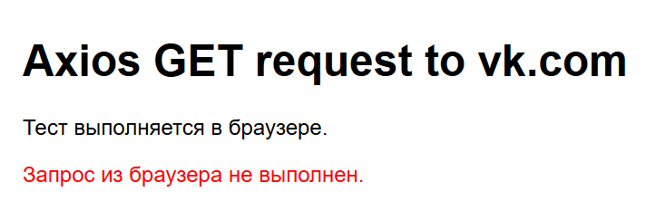
- Запрос через node.js получился
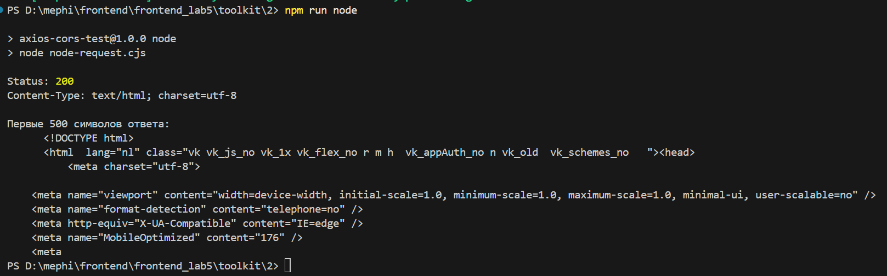

Запрос из браузера был выполнен со страницы `http://localhost:8080`, а отправлен на `https://vk.com`. Это разные origin, поэтому быд применён механизм безопасности CORS.

Node.js выполняет запрос напрямую, поэтому CORS-политика не применяется.

## Задание 3
- [Исходный код](toolkit/3/)
- Запрос из браузера получился
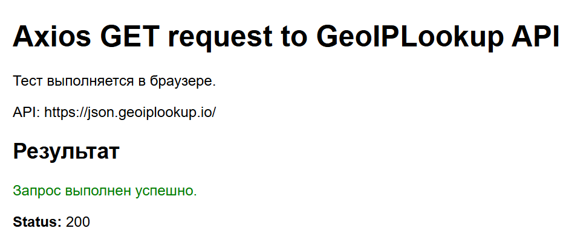
- Запрос из Node.js тоже выполнился
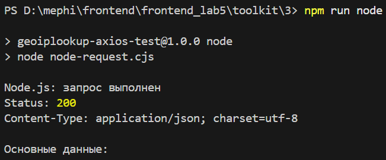

В отличие от предыдущего задания, здесь происходит обращение к API, которая отдаёт JSON и разрешает обращения с других origin. 

## Задание 4
Postman установлен
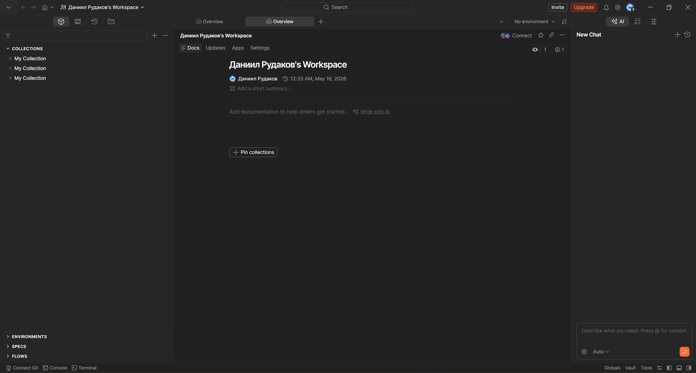

## Задание 5
- Запрос к VK
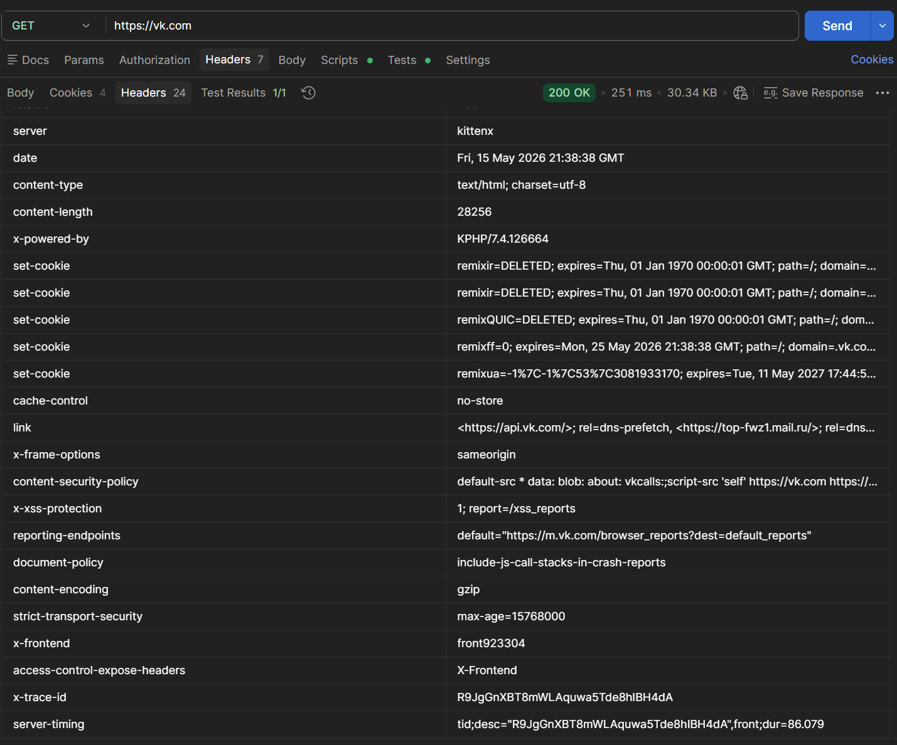
- Запрос к GeoIP
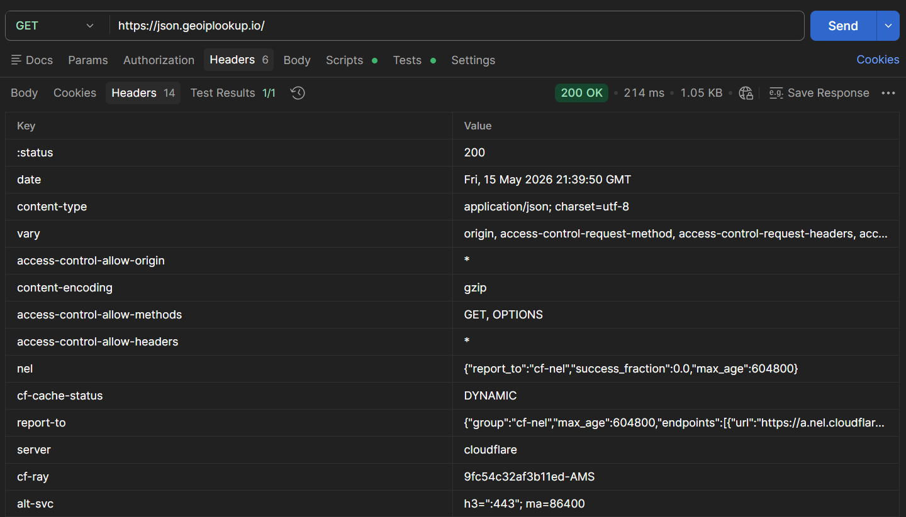

В обоих случаях запрос был успешен. В случае с VK вернулась страница (можно понять по `Content-Type`), в случае с geoip вернулся JSON. В случае с VK также есть `set-cookie` и защитные заголовки, например, `x-frame-options: sameorigin`, который запрещает встраивать страницу во фрейм на чужих сайтах. `Strict-Transport-Security` - дальнейшие обращения по https. Нет заголовка `access-control-allow-origin: *`, поэтому браузерный запрос был заблокирован.

В случае с geoip есть заголовок `access-control-allow-origin: *`, что позволяет обращаться с других origin. Другие заголовки показывают, что сервер явно настроен на обработку cross-origin-запросов.

## Задание 6
Получил API-ключ
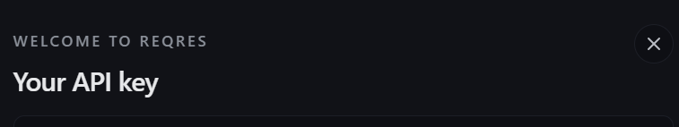
С помощью ключа запросил список пользователей
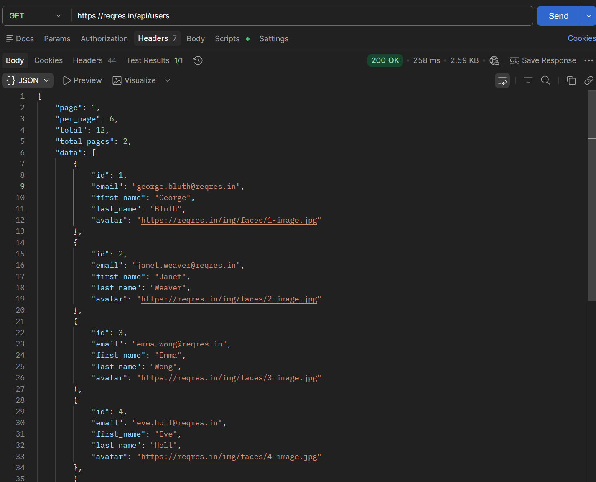
Для регистрации в Headers указал API-ключ, в Body указал email и password в urlencoding. Пользователь зарегистрирован
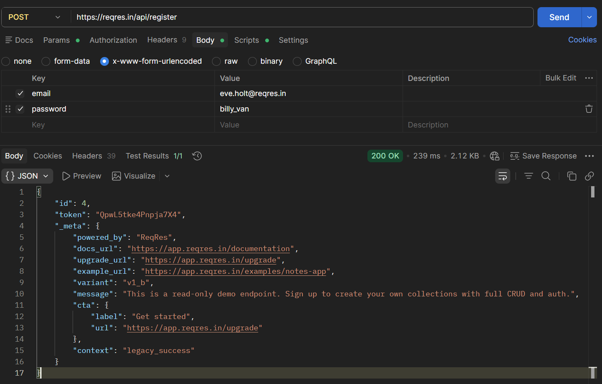

## Задание 7
Залогиниться тоже получилось
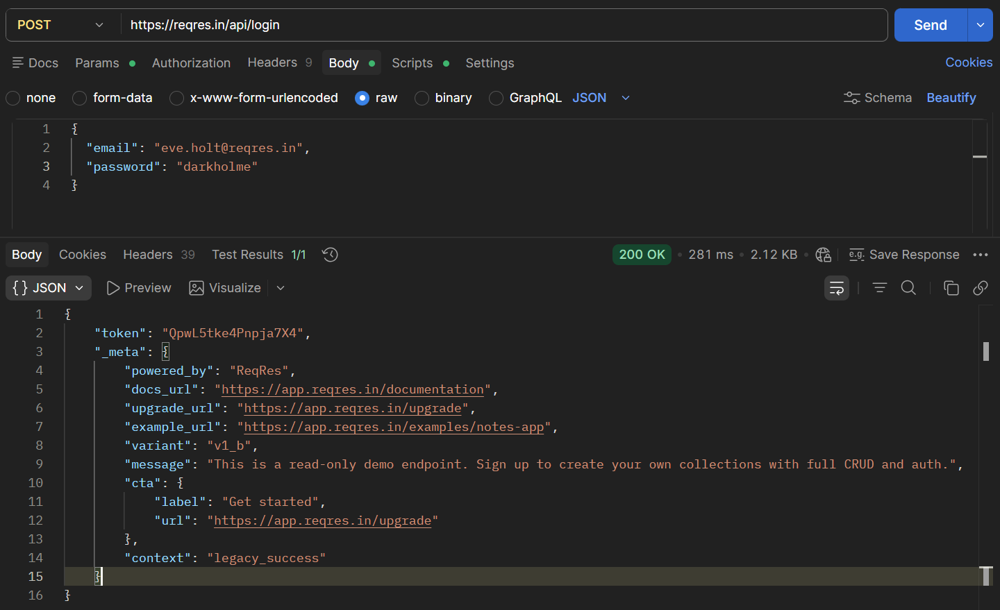

## Задание 8
- local
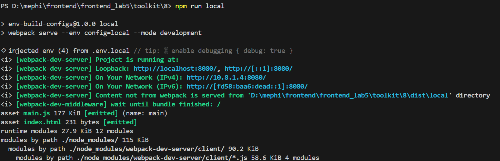
- dev
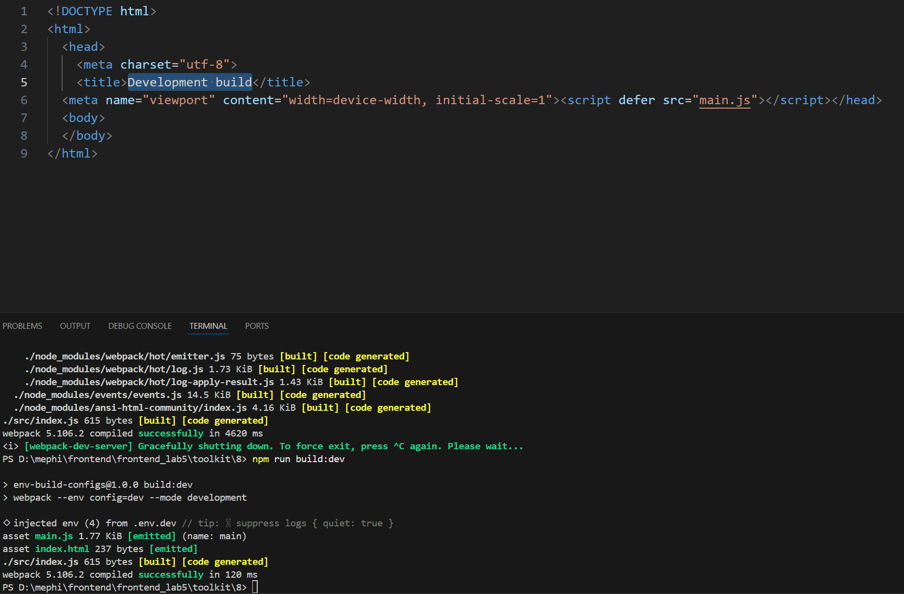
- prod
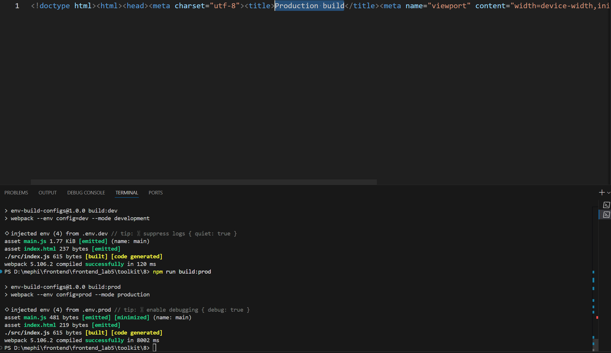
